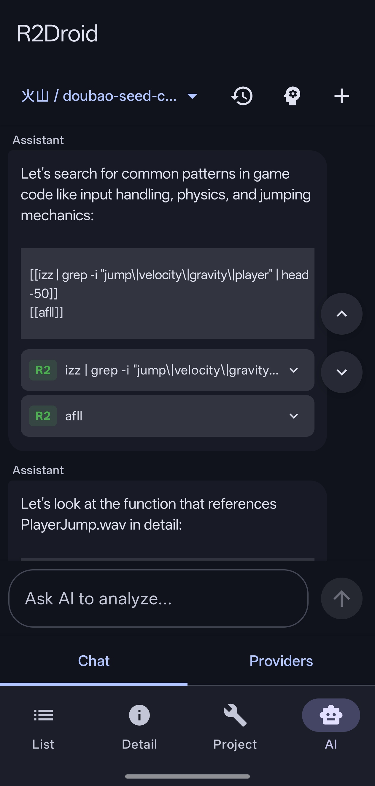
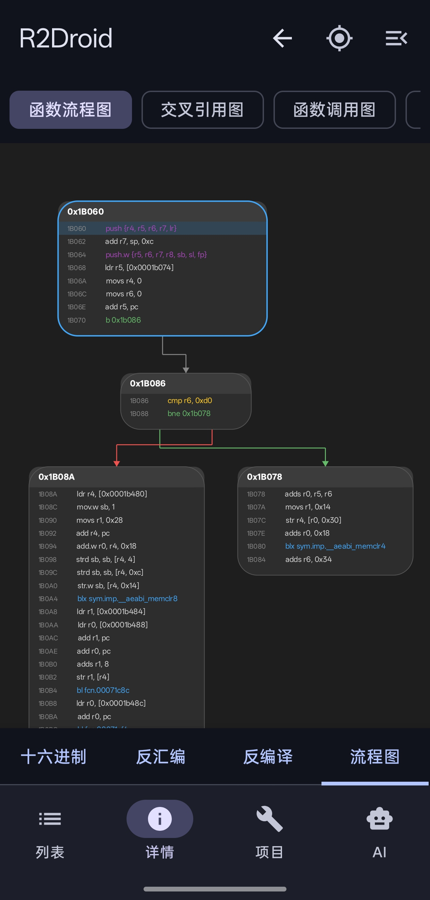

# R2Droid

**R2Droid** is a modern, native Android GUI for the [Radare2](https://github.com/radareorg/radare2) reverse engineering framework. Built with Kotlin and Jetpack Compose, it brings powerful static analysis, dynamic instrumentation, and AI-assisted reverse engineering capabilities directly to your mobile device.

[**🇨🇳 中文说明**](README_CN.md)

## ✨ Highlighted Features

*   🤖 **AI Assistant (Auto-RE)**: Powered by OpenAI-compatible APIs. The AI can autonomously analyze binaries, execute radare2 commands, and run JavaScript scripts within the app to answer your reverse engineering questions.
*   💉 **R2Frida Integration**: Powerful dynamic instrumentation on Android. Auto-download plugins, list remote/local processes, attach/spawn apps, and execute custom Frida scripts seamlessly.
*   📊 **Visual Graph Viewer**: Interactive, touch-friendly node-based graphs. Supports Function Flow (Basic Blocks), Call Graphs, Global Call Graphs, and Cross-Reference (Xref) graphs.
*   📑 **Report Exporter**: Generate comprehensive analysis reports in Markdown, HTML, JSON, or automatically generate Frida Hook script templates based on your analysis.

## 🛠️ Core Capabilities

*   **Project Management**: Save, load, and manage analysis sessions with custom project directories.
*   **Hex Viewer**: High-performance, virtualized hex editor with editing capabilities (`wx`, `w`, `wa`).
*   **Disassembly & Decompiler**: Infinite scrolling disassembly view with syntax highlighting, jump arrows, navigation history, and pseudo-code generation (via `r2ghidra` or `jsdec`).
*   **Global Search**: Quickly search for Strings, Hex, Assembly, Regex, ROP Gadgets, and specific values.
*   **Embedded Terminal**: Full-featured terminal environment using `r2pipe` and `termux-view` for executing raw r2 commands.
*   **Analysis Views**: Binary Overview, Sections, Symbols, Imports, Relocations, Strings, Functions list, and detailed Cross-references (Xrefs).
*   **Background Mode**: Persistent notification service prevents the app from being killed during heavy background analysis.
*   **Customization**: Dark/Light themes, custom fonts, language switching (English/Chinese), and custom `.radare2rc` configuration.

## Screenhots

## 🚀 Roadmap / TODO

*   [ ] **Terminal Helper Keys**: Add a row of extra keys (ESC, Tab, Ctrl, Arrows) above the keyboard.
*   [ ] **ESIL Emulation UI**: Visual interface for stepping through code using ESIL.
*   [ ] **Plugin Manager**: UI to easily install and manage extended Radare2 plugins.

## 📦 Build Instructions

1.  Clone the repository.
2.  Open in Android Studio (Ladybug or newer recommended).
3.  Ensure JDK 21 is selected as the Gradle JVM.
4.  Build and Run on an Android device (min SDK 24).

> **Note**: The app includes a pre-compiled `radare2` binary and assets which are extracted upon first launch.

## 📄 License

This project is open-source under the [MIT License](LICENSE).
Acknowledgments to the **Radare2** team, the **Frida** project, and the **Termux** project for their underlying technologies.

---
## Star History

